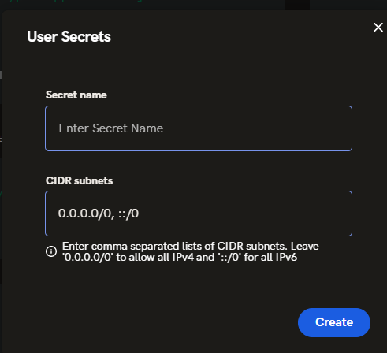
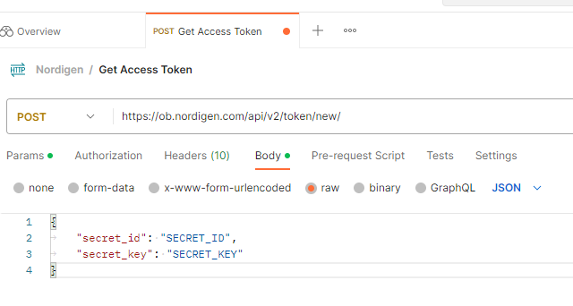
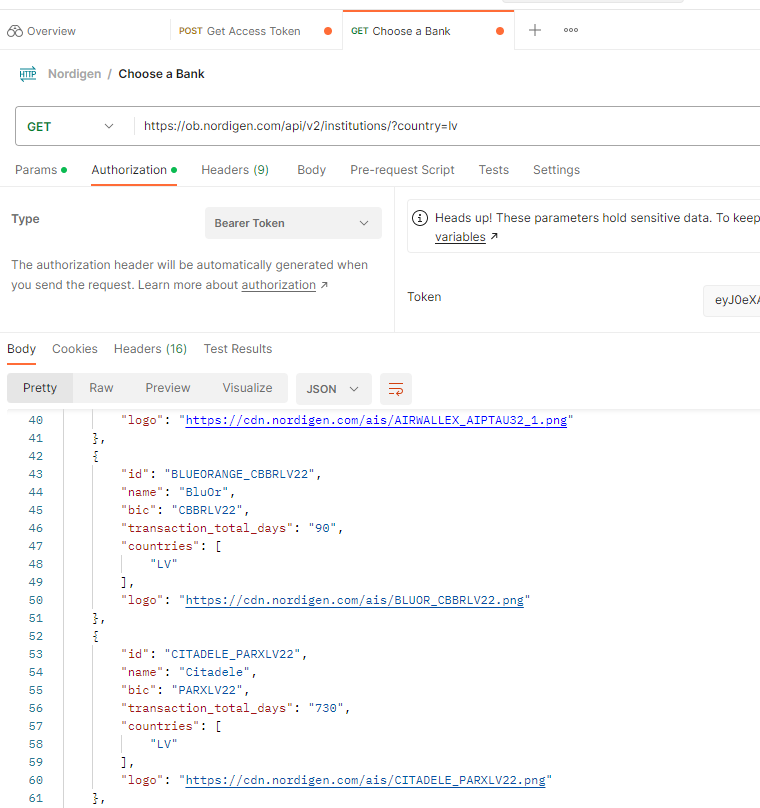
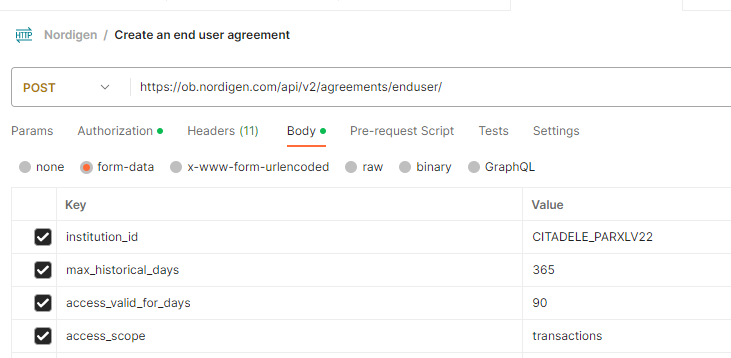
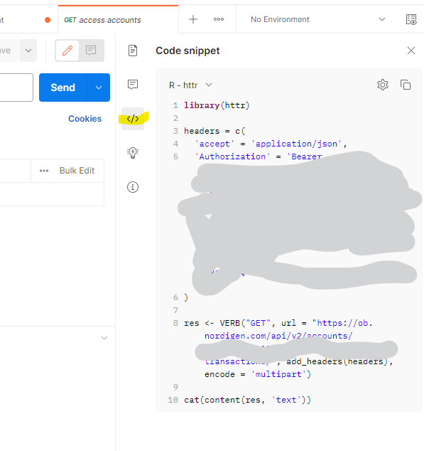
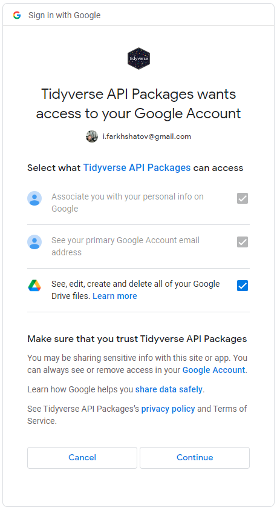
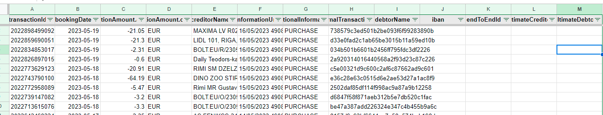

# Idea
I like to control everything in my life. Especially if speaking about controlling my finance it is crucial.
So there are many free and paid apps for mobile, but I used to write down all my expenses in Google Sheets since I can customize my dashboard whatever I want.
I did it through google forms and even wrote a telegram bot for that. But all of these require to do some manual input. Therefore I start thinking about how such applications work and how can i access such API services for free and for personal use, rather than installing the application.  
And I found it! Quickly searching on Google I saw there is a company **GoCardless** which provides services for *Open Banking* named [**Nordigen**](https://nordigen.com/en/). Service is superior, there are more than 2370 Banks connected to their API which can access your banking statement and since it is API you can automatize this by using any programming language. I prefer **R**, you can do the same steps for **Python** or any other language.

# Set-up
## Nordigen API connection
I'd better recommend you follow the instruction from their [documentation](https://nordigen.com/en/account_information_documenation/integration/quickstart_guide/). It is straightforward.

1. Register or Login to [Nordigen](https://auth.nordigen.com/login?state=hKFo2SBJR1BwN2E5MzRrVGk4MEhoc3dPbmpLS3VhYW9EU1RCeaFupWxvZ2luo3RpZNkgcnR2UGxTUUM2dEtnQU5kMHFTOUVGTEhWN0tEMmwzRXmjY2lk2SBDamdoTDczVkNpQmh0b1RGdk1xNEhGREpvMmhVWXRZdA&client=CjghL73VCiBhtoTFvMq4HFDJo2hUYtYt&protocol=oauth2&redirect_uri=https%3A%2F%2Fob.nordigen.com%2Fcomplete%2Fauth0%2F&response_type=code&scope=openid%20profile%20email) (I used Google Auth)
2. Go to **Project --> User secret** there generate ``$SECRET\_ID and $SECRET\_KEY`` by pressing "Create new" 
   
Save it as JSON and copy your key:
``{
	"secret_id": "SECRET_ID",
	"secret_key": "SECRET_KEY"
}``
3. Go to Postman, there create a new request ([Get Access Token](https://ob.nordigen.com/api/v2/token/new/)) and fill it like this:   
   
From the output, you need to take only the access token.   
4. Create a new request ([Choose a Bank](https://ob.nordigen.com/api/v2/institutions/?country=lv)), and paste the access token in the tab (Authorization --> Bearer Token):

5. Create a new request ([Create an end-user agreement](https://ob.nordigen.com/api/v2/agreements/enduser/)). Here you need to set up the body parameters:
   1. institution_id
   2. max_historical_days
   3. access_valid_for_days
   4. access_scope   
Do not forget to keep Bearer Token in the Authorization tab:

6. Copy **id** from the response (ID of the agreement) and paste it into the next request ([Build a Link](https://ob.nordigen.com/api/v2/requisitions/)). Here put the following body parameters:
   1. redirect -- *use any site if you have, or https://google.com*
   2. institution_id
   3. reference -- *any random number*
   4. agreement -- *ID of the agreement*
   5. user_language   
It will generate **link**, from there you should do authentication with your bank to allow **GoCardless** to extract your data then it will redirect to **redirect** page.   
7. Next step is to GET a list of accounts for the user. The links should be the following: ``https://ob.nordigen.com/api/v2/requisitions/<requisition_ID>``. requisition_ID is the response id from the previous step.
8. Pick one of the available accounts for the user and put them in the next request to receive the history of transactions: ``https://ob.nordigen.com/api/v2/accounts/<account_ID>/transactions/``


## Use this API in R
The ease of using Postman is that it allows you to convert requests into your language syntax e.g. R-httr. Click the right top button *code snippet </>* to choose the language and just copy the code to your system and voilà, you have a working script to return data of the transactions into the script! 


To convert a data.frame like data just uses this code:
```R

cat(content(res, 'text'))

#take only transactions from content
parsed_content <- content(res, "parsed")$transactions
#take only booked data and convert it into data.frame
booked_data <- type.convert(
  bind_rows(
    lapply(parsed_content$booked, as.data.frame)
    ), as.is = TRUE)

booked_data$bookingDate <- as.Date(booked_data$bookingDate)

table(booked_data$additionalInformation)
```
For me the return of my bank account was like this:
```R
> table(booked_data$additionalInformation)

                   CARD FEE                CASH DEPOSIT             CASH WITHDRAWAL            INTEREST PAYMENT 
                          5                           2                           8                           6 
    INWARD CLEARING PAYMENT      INWARD INSTANT PAYMENT             INWARD TRANSFER               LOAN DRAWDOWN 
                         17                          69                           1                           1 
    OUTWARD INSTANT PAYMENT            OUTWARD TRANSFER         PRINCIPAL REPAYMENT                    PURCHASE 
                         20                          16                           6                        1477 
REIMBURSEMENT OF COMMISSION          RETURN OF PURCHASE     REVERSAL OF TRANSACTION 
                          1                           5                           1
```
I should reconsider my shopping behavior, more than 4 purchases per day :)

## Push data to Google sheet
1. Suppose we create an empty Google Sheet.
2. We will use two packages [googledrive](https://cran.r-project.org/web/packages/googledrive/index.html) and [googlesheets4](https://cran.r-project.org/web/packages/googlesheets4/index.html). First will be used as an authenticator to your google drive docs, second one for Google sheet API. 
3. Once both are installed, use the function ``drive_auth()`` for the authentication:
```R
> drive_auth()
The googledrive package is requesting access to your Google account.
Enter '1' to start a new auth process or select a pre-authorized account.
1: Send me to the browser for a new auth process.
```
Choose option 1 and it will redirect you to the Google form there allows access to the API. Choose the last option as well (*See, edit, create and delete all of your Google Drive files*) 


1. Return to R and you will see that authentication is successful:
```R
Selection: 1
Waiting for authentication in browser...
Press Esc/Ctrl + C to abort
Authentication complete.
```
1. Now you can find ID of the new sheet (or use the existing one) by command ``gs4_find()``
```R
gs4_find()
Auto-refreshing stale OAuth token.
# A dribble: 42 × 3
   name                                                  id                                           drive_resource   
   <chr>                                                 <drv_id>                                     <list>           
 1 nordigen_test                                         1TqBPf4b-gbAIhxQ3S9JPzv4 <named list [35]>
 ```   
1. Copy the id and paste it to the function which will append data from Nordigen API to Google sheet ``write_sheet(ss = "SheetID", booked_data, sheet = 2)``.
2. As the result on the second page of the sheet **nordigen_test** we have data straight goes from **Our bank account** to **Google Sheet**:
.
1. If you then want to append new data to the sheet then use the following code ``sheet_append("1SheetID", booked_data  , sheet = 2)`` and that's it. 
2. Basically, you set up this script on cron task (do not forget to change the agreement from [Step 5](#nordigen-api-connection) ) and it will pull once per day or so data with **Nordigen API** from your bank account and update google Sheets.
3. There area for the playground, such as using [stringr](https://stringr.tidyverse.org/) package to extract MCC and shop name from the data, customize and manipulate and create your own best account balance dashboard.
4. Of course, it can be used in Shiny Apps or application deployemnt.